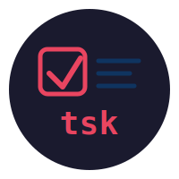

<p align="center">
  
</p>

<h1 align="center">tsk</h1>

<p align="center">
  <em>Because your memory is trash and you know it.</em>
</p>

<p align="center">
  A dead-simple task tracker that lives in your terminal. No bloat. No dependencies. No excuses.
</p>

---

## Why?

You don't need Jira. You don't need Notion. You don't need a kanban board with 47 columns and a burndown chart for buying milk.

You need to write stuff down and check it off. That's it. **tsk** does that.

## Install

```bash
npm install -g github:FK78/tsk
```

Or if you have trust issues (valid):

```bash
git clone https://github.com/FK78/tsk.git
cd tsk
npm link
```

## Usage

```bash
# Remember things
tsk add "Buy groceries"
# Task added successfully (ID: 1)

# Change your mind (again)
tsk update 1 "Buy groceries and cook dinner"

# Give up entirely
tsk delete 1
```

## Commands

| Command | What it does |
|---------|-------------|
| `tsk add <description>` | Add a task. Revolutionary. |
| `tsk update <id> <description>` | Fix your typo or change your mind |
| `tsk delete <id>` | Pretend it never existed |
| `tsk mark-in-progress <id>` | You've started. Proud of you. |
| `tsk mark-done <id>` | Look at you being productive |
| `tsk list` | See everything you're avoiding |
| `tsk list todo` | The guilt list |
| `tsk list in-progress` | Things you started but let's be honest... |
| `tsk list done` | Your trophy case |

## How it works

Tasks live in `~/.tsk/tasks.json`. Created automatically because **tsk** believes in you even when you can't find the file.

Each task looks like:

```json
{
  "id": 1,
  "description": "Buy groceries",
  "status": "todo",
  "createdAt": "2026-07-01T12:00:00.000Z",
  "updatedAt": null
}
```

Statuses: `todo` → `in-progress` → `done` (the lifecycle of ambition)

## Project structure

```
tsk/
├── index.js           # The bouncer - decides who gets in
├── commands/
│   ├── add.js         # Adds tasks to your pile
│   ├── update.js      # For the indecisive
│   ├── delete.js      # The denial button
│   ├── mark.js        # Status updates for your tasks, not your ex
│   └── list.js        # Confronts you with reality
└── lib/
    ├── constants.js   # Where the tasks file lives
    └── utils/
        ├── readTasksFile.js
        ├── writeTasksFile.js
        └── withTask.js    # The helper that does the heavy lifting
```

## Requirements

- Node.js 18+
- A willingness to be honest with yourself

## Credit

Built as a solution to the [Task Tracker](https://roadmap.sh/projects/task-tracker) project on roadmap.sh.

## License

MIT - do whatever you want, I'm not your manager.
